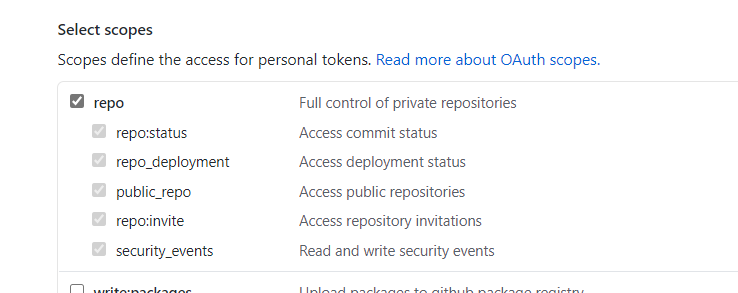

# Template Workflow to auto-deploy any new ACR image to AKS.

The workflows in this repo show how to auto deploy any new images in ACR ( Azure Container Registery ) to AKS ( Azure Kubernetes Cluster). 

# Getting started

### 1. Prerequisites

The following prerequisites are required to make this repository work:
- Azure subscription
- Contributor access to the Azure subscription
- Resource group created on azure portal
- Azure container registry resource created in the resource group
- Azure kubernetes cluster service created in the resource group

### 2. Create repository

To get started with Azure Triggers in GitHub, simply create a new repo based off this template, by clicking on the green "Use this template" button:

<p align="center">
  
</p>

### 3. Setting up the required secrets
#### To allow GitHub Actions to access Azure
An [Azure service principal](https://docs.microsoft.com/en-us/azure/active-directory/develop/app-objects-and-service-principals) needs to be generated. Just go to the Azure Portal to find the details of your resource group. Then start the Cloud CLI or install the [Azure CLI](https://docs.microsoft.com/en-us/cli/azure/install-azure-cli?view=azure-cli-latest) on your computer and execute the following command to generate the required credentials:

```sh
# Replace {service-principal-name}, {subscription-id} and {resource-group} with your 
# Azure subscription id and resource group name and any name for your service principle
az ad sp create-for-rbac --name {service-principal-name} \
                         --role contributor \
                         --scopes /subscriptions/{subscription-id}/resourceGroups/{resource-group} \
                         --sdk-auth
```

This will generate the following JSON output:

```sh
{
  "clientId": "<GUID>",
  "clientSecret": "<GUID>",
  "subscriptionId": "<GUID>",
  "tenantId": "<GUID>",
  (...)
}
```

Add this JSON output as [a secret](https://help.github.com/en/actions/configuring-and-managing-workflows/creating-and-storing-encrypted-secrets#creating-encrypted-secrets) with the name `AZURE_CREDENTIALS` in your GitHub repository:

<p align="center">
  
</p>

To do so, click on the Settings tab in your repository, then click on Secrets and finally add the new secret with the name `AZURE_CREDENTIALS` to your repository.

Please follow [this link](https://help.github.com/en/actions/configuring-and-managing-workflows/creating-and-storing-encrypted-secrets#creating-encrypted-secrets) for more details. 


#### Credentials required to push/pull to azure container registry
Following secrets are credentials required to access azure container registry.These can be set using the azure credentials generated above-
- REGISTRY_USERNAME will be value of "clientId" from the azure credentials generated.
- REGISTRY_PASSWORD will be value of "clientSecret" from the azure credentials generated.


These secrets will be added as shown below-
<p align="center">
  
</p>

#### To Allow Azure to trigger a GitHub Workflow
 We also need github PAT token with `repo` access so that we can trigger a github workflow when there is a new image on Azure Container Registry. 
 Steps to setup PAT token can be found [here](https://docs.github.com/en/github/authenticating-to-github/creating-a-personal-access-token).
 
 
 Repo section can be updated as shown below-
 <p align="center">
  
</p>
 
 Add the PAT token with as [a secret](https://help.github.com/en/actions/configuring-and-managing-workflows/creating-and-storing-encrypted-secrets#creating-encrypted-secrets) with the name `PATTOKEN` in your GitHub repository:
 <p align="center">
  
</p>


### 4. Setup and Define Triggers

### Events that trigger workflow
Github workflows are triggered based on events specified inside workflows. These events can be from inside the github repo like a push commit or can be from outside like a webhook([repository-dispatch](https://docs.github.com/en/developers/webhooks-and-events/webhook-events-and-payloads#repository_dispatch)).
Details can be found [here](https://docs.github.com/en/actions/reference/events-that-trigger-workflows).

#### Setup Trigger

We have created sample workflow file [setup_acr_trigger](/.github/workflows/setup_acr_trigger.yml) that deploys resources required for setup.
Setup involves creating an event grid subscription to the ACR specified in workflow.
Creating this subscription will allow workflows to get triggered on events occuring in ACR subscribed.
Only workflows having repository dispatch event `containerregistry-imagepushed` will be triggered.

User needs to set the following environment variables in [setup_acr_trigger](/.github/workflows/setup_acr_trigger.yml) workflow-
- RESOURCE_GROUP
- CONTAINER_REGISTRY_NAME
After setting environment variables changes can be saved by commit which will trigger this workflow for required setup.

#### Define Trigger
We have created sample workflow file [deploy_image](/.github/workflows/deploy_image.yml#L3) with the necessary trigger on ACR set. You need to update this workflow file [deploy_image](/.github/workflows/deploy_image.yml) with values for following environment variables-
- RESOURCE_GROUP
- CLUSTER_NAME

 If you add this repository dispatch event `containerregistry-imagepushed` in other workflows, they will also start listening to the image push events in the configured ACR. 
  
### 5. Testing the trigger

Now whenever we push an image to the above configured ACR, it will trigger the workflow file [deploy_image](/.github/workflows/deploy_image.yml). Here are couple of ways you can use to push a new image to ACR. 

#### Option 1:
A sample workflow [push_sample_image](/.github/workflows/push_sample_image.yml) is available which can be used to push image provided to ACR.
We need to provide ACR details in above workflow and commit the workflow file. The commit will trigger the workflow [push_sample_image](/.github/workflows/push_sample_image.yml) which will push a new image to ACR and trigger workflow [deploy_image](/.github/workflows/deploy_image.yml) to deploy the image to AKS.


#### Option 2:
We can also use command line to push image to our container registry using following docker login and push command-
- Use below command to login to your regisry-

    ``` docker login {{container-registry-name}}.azurecr.io ```
 
  User will be promted for username and password to access the docker registry server which can be taken from azure credentials generated in step 3-
    - USERNAME: 'clientId' part of credentials generated
    - PASSWORD: 'clientSecret' part of credentials generated

- Before any docker image is pushed to azure container registry it needs to be converted to the registry format.
  This can be done using following command-
  
  ``` docker tag {{any-docker-image:tag}} {{container-registry-name}}.azurecr.io/{{repo-name}}:{image-tag} ```
  
    - 'container-registry-name' is the name of the azure container registry user wants to push image to.
    - 'repo-name' can be any name specified by user.This will be the the repository name used to store the image in the registry.
    - 'image-tag' is the tag name specified by user.This will be the tag(version) of the repo specified.
    - 'any-docker-image:tag' can be any existing image which user wants to push to registry.
    
  As a sample user use image 'nginx:latest'  as 'any-docker-image:tag'.This image can be pulled locally using command
  
     ``` docker pull nginx ```
    
- Use below command to push image to registry-
    
     ``` docker push {{container-registry-name}}.azurecr.io/{{repo-name}}:{image-tag} ```
  
     This will trigger workflow [deploy_image](/.github/workflows/deploy_image.yml) which will deploy the pushed image to AKS.


### 6. Review 
The above docker push should have auto-triggered workflow [deploy_image](/.github/workflows/deploy_image.yml) which deploys the docker image to an Azure Kubernetes Cluster. You can check the run created by this push under Actions tab. 
